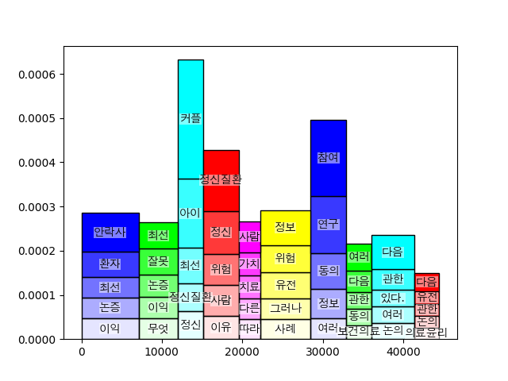
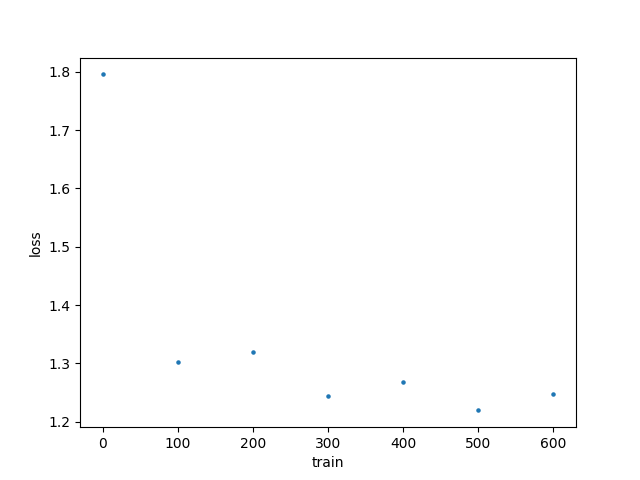

## Korean intelligence toolkit (WIP)

Generates report from Korean texts, using NLP. 

### Features

#### Segmentation


### Models 
Parameter tuning can be applied

#### Bert pretraining
(hidden_size = 192)
```
[Evaluation result]
global_step = 100000
loss = 10.826917
masked_lm_accuracy = 0.035499398
masked_lm_loss = 10.087056
next_sentence_accuracy = 0.53
next_sentence_loss = 0.69253767
```

#### NER training

AdamWeightDecay, SparseCategoricalCrossentropy.

Training in progress... (It takes 20hr)


Some preliminary results : 
```
 헬렌의 여동생 페넬로페는 임신... -> 헬렌  
 소크라테스가 동시대를 살던 사람들의 -> 소크라테스 
```

### Training Dataset
Proprietary datasets 
* 10GB orthogonal korean texts
* 1GB parallel korean texts
* 0.2GB NER tagged korean texts

Public datasets
* NER tagged texts from CNU, KAIST, KMOU 

### TODO 
* NER
* Paraphraser

