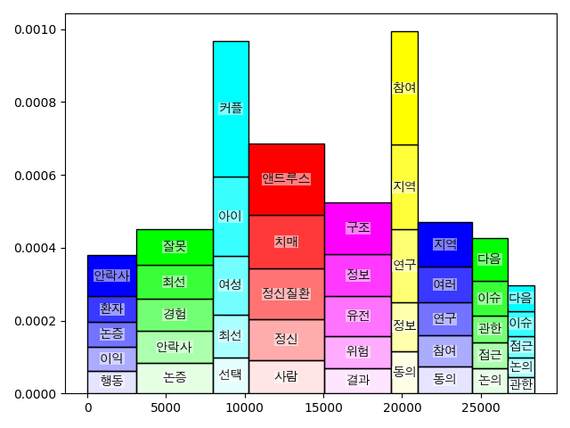

## Korean intelligence toolkit (WIP)

Generates report from Korean texts, using NLP. 

### Features

#### Segmentation


#### Bert pretraining
(hidden_size = 192)
```
[Evaluation result]
global_step = 100000
loss = 10.267181
masked_lm_accuracy = 0.045719843
masked_lm_loss = 9.683972
next_sentence_accuracy = 0.76
next_sentence_loss = 0.55322576
```

### Training Dataset
Proprietary datasets 
* 10GB orthogonal korean texts
* 1GB parallel korean texts
* 0.2GB NER tagged korean texts

### TODO 
* NER
* Paraphraser

